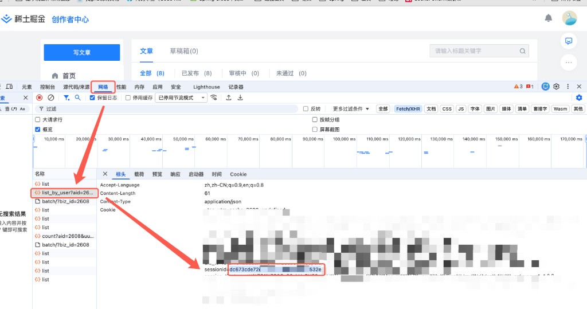

# 掘金 MCP 服务器

<p align="center">
    
    
    
    
</p>

**掘金 MCP 服务器** 是一个基于 [MCP 协议](https://modelcontextprotocol.io) 的掘金平台接入服务，让 AI 助手（如 Claude、Cursor、Trae 等）能够直接管理你的掘金文章。

**核心价值**：告别手动复制粘贴，通过自然语言让 AI 帮你发布文章、管理草稿、查询内容，实现「动动嘴皮子就能写博客」的流畅体验。

**使用它能带来什么**：
- ✍️ 直接通过对话让 AI 发布文章到掘金
- 📋 一键获取草稿列表、文章列表
- 🏷️ 自动获取分类标签，无需手动查找
- 🔄 支持更新、删除等完整文章生命周期管理

> **如果这个项目帮到了你，请帮忙点个 Star ⭐️，你的支持是我们更新的动力！**

---

## 📚 目录

- [功能特性](#-功能特性)
- [为什么选择它？](#-为什么选择它)
- [快速开始](#-快速开始)
- [配置说明](#-配置说明)
- [工具列表](#-工具列表)
- [使用示例](#-使用示例)
- [API 接口](#-api-接口)
- [开发](#-开发)
- [常见问题](#-常见问题)
- [License](#-license)

---

## ✨ 功能特性

- **🚀 一键发布**：`publish_article` 自动完成创建草稿 + 发布两步操作
- **📝 草稿管理**：创建、更新、删除、列出草稿
- **📄 文章管理**：获取、更新、删除已发布文章
- **🏷️ 分类标签**：自动获取掘金官方分类和热门标签
- **👤 用户信息**：获取当前登录用户信息
- **🔒 安全可靠**：Cookie 本地存储，不上传任何数据到第三方
- **⚡ 多客户端支持**：兼容 Cursor、Trae、Claude Desktop 等 MCP 客户端

---

## 🚀 为什么选择它？

传统发布掘金文章的流程：
1. 在编辑器里写好文章
2. 打开浏览器登录掘金
3. 复制标题、粘贴内容
4. 选择分类、添加标签
5. 点击发布

**使用掘金 MCP 服务器后**：

```
你：帮我发布一篇掘金文章，标题是「我的 2024 技术总结」，内容如下...

AI：已为您创建草稿并发布成功！文章链接：https://juejin.cn/post/xxx
```

---

## 🏁 快速开始

### 环境要求

| 组件 | 版本要求 | 说明 |
|------|----------|------|
| **Python** | ≥ 3.10 | 核心运行环境 |
| **Cookie** | - | 掘金登录凭证 |

### 1. 获取 Cookie

1. 登录 [掘金](https://juejin.cn/)，进入创作者中心
2. 按 F12 打开浏览器开发者工具，切换到 **Network（网络）** 标签
3. 刷新页面，找到 `list_by_user` 请求
4. 在 **Request Headers** 中复制 `sessionid` 字段



### 2. 安装

#### 方式一：uvx 运行（推荐，无需安装）

```bash
uvx juejin-release-mcp
```

#### 方式二：pip 安装

```bash
pip install juejin-release-mcp
```

#### 方式三：源码安装

```bash
git clone https://github.com/yourname/juejin-release-mcp.git
cd juejin-release-mcp
pip install -e .
```

### 3. 配置 MCP 客户端

#### Cursor / Trae 配置

在 MCP 配置文件中添加：

```json
{
  "mcpServers": {
    "juejin": {
      "command": "uvx",
      "args": ["juejin-release-mcp"],
      "env": {
        "JUEJIN_COOKIE": "sessionid=your_sessionid"
      }
    }
  }
}
```

或使用 pip 安装后：

```json
{
  "mcpServers": {
    "juejin": {
      "command": "juejin-release-mcp",
      "env": {
        "JUEJIN_COOKIE": "sessionid=your_sessionid"
      }
    }
  }
}
```

#### 命令行运行

```bash
export JUEJIN_COOKIE="sessionid=your_sessionid"
juejin-release-mcp
```

---

## ⚙️ 配置说明

### 环境变量

| 变量名 | 必填 | 说明 | 默认值 |
|--------|------|------|--------|
| `JUEJIN_COOKIE` | ✅ | 掘金 Cookie，格式：`sessionid=xxx` | - |
| `JUEJIN_AID` | ❌ | 应用 ID | `2608` |
| `JUEJIN_UUID` | ❌ | 用户唯一标识 | - |
| `JUEJIN_CSRF_TOKEN` | ❌ | 防爬校验令牌 | - |
| `JUEJIN_TIMEOUT` | ❌ | 请求超时（秒） | `30` |
| `JUEJIN_MAX_RETRIES` | ❌ | 最大重试次数 | `3` |

---

## 🔧 工具列表

| 工具名 | 描述 | 必填参数 |
|--------|------|----------|
| `publish_article` | 发布文章（创建草稿+发布） | `title`, `content` |
| `create_draft` | 创建草稿 | `title`, `content` |
| `update_draft` | 更新草稿 | `draft_id` |
| `delete_draft` | 删除草稿 | `draft_id` |
| `list_drafts` | 获取草稿列表 | - |
| `get_article` | 获取文章详情 | `article_id` |
| `list_articles` | 获取文章列表 | - |
| `update_article` | 更新文章 | `article_id` |
| `delete_article` | 删除文章 | `article_id` |
| `list_categories` | 获取分类列表 | - |
| `list_tags` | 获取标签列表 | - |
| `get_user_info` | 获取用户信息 | - |

---

## 💡 使用示例

### 发布文章

```
请帮我发布一篇掘金文章：
- 标题：我的第一篇技术博客
- 内容：# Hello World

这是我的第一篇博客文章，介绍一下我的开源项目...
- 分类：后端
- 标签：Python, MCP
```

### 查看草稿列表

```
请列出我在掘金的所有草稿
```

### 获取分类标签

```
请显示掘金的文章分类和热门标签
```

### 更新文章

```
请帮我更新文章 7382918472656487462，在末尾添加「更新于 2024-01-01」
```

---

## 🔌 API 接口

本 MCP 服务对接的掘金 API（前缀 `https://api.juejin.cn`）：

| 接口 | 方法 | 说明 |
|------|------|------|
| `/content_api/v1/article_draft/create` | POST | 创建草稿 |
| `/content_api/v1/article_draft/update` | POST | 更新草稿 |
| `/content_api/v1/article_draft/delete` | POST | 删除草稿 |
| `/content_api/v1/article_draft/list_by_user` | POST | 草稿列表 |
| `/content_api/v1/article/publish` | POST | 发布文章 |
| `/content_api/v1/article/list_by_user` | POST | 文章列表 |
| `/tag_api/v1/query_category_list` | POST | 分类列表 |
| `/tag_api/v1/query_tag_list` | POST | 标签列表 |

---

## 🛠️ 开发

```bash
# 安装开发依赖
pip install -e ".[dev]"

# 运行测试
pytest

# 代码检查
ruff check src/
mypy src/

# 本地运行
export JUEJIN_COOKIE="sessionid=xxx"
python -m src.juejin_release_mcp.server
```

### 发布到 PyPI

```bash
# 构建
python -m build

# 检查
twine check dist/*

# 发布到 TestPyPI（可选）
twine upload --repository testpypi dist/*

# 发布到 PyPI
twine upload dist/*
```

---

## ❓ 常见问题

### Q: 提示 "JUEJIN_COOKIE 环境变量未设置"

A: 请确保已正确设置环境变量，或在 MCP 配置中添加 `env` 配置。

### Q: 发布失败，提示鉴权错误

A: Cookie 可能已过期，请重新获取并更新。

### Q: 提示 "参数错误"

A: 请检查必填参数是否正确传递，特别是 `title` 和 `content` 字段。

---

## ⚠️ 注意事项

1. **Cookie 安全**: Cookie 包含敏感信息，请勿泄露或提交到代码仓库
2. **Cookie 有效期**: Cookie 可能会过期，如遇鉴权失败请重新获取
3. **接口限制**: 掘金 API 可能有频率限制，请合理使用
4. **字数统计**: `encrypted_word_count` 和 `origin_word_count` 参数为可选，如需精确控制可从浏览器抓包获取

---

## 🔗 相关项目

- [apollo-mcp](https://github.com/iceycn/mcp-server-apollo) - Apollo 配置中心 MCP 服务器
- [root_seeker](https://gitee.com/icey_1/root_seeker) - AI 驱动的错误根因分析工具

---

## 📄 License

MIT License © 2026

---

**如果这个项目帮到了你，请给一个 Star ⭐️ 支持一下！**
